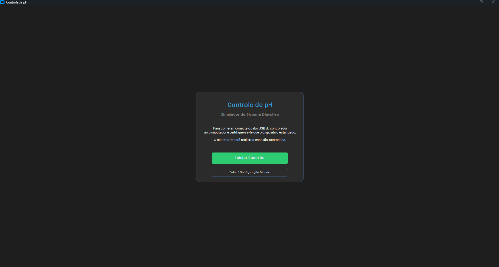
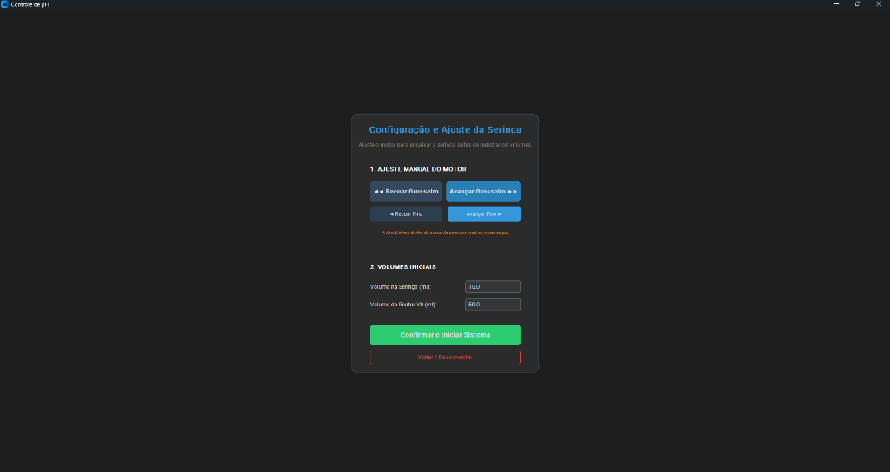
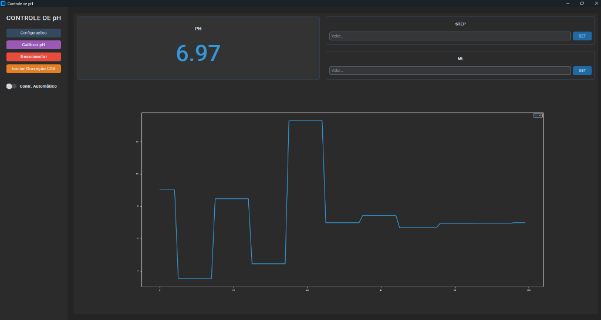
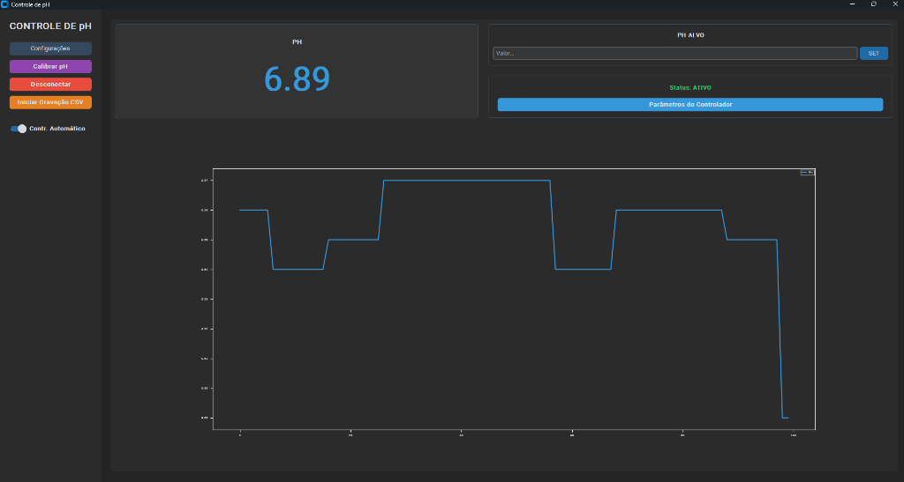

# Manual do Usuário - Interface de Controle de pH

Bem-vindo ao manual da Interface Homem-Máquina (IHM) do Simulador de Sistema Digestivo. Este guia rápido ajudará você a utilizar as principais funções do programa.

## Pré-requisitos e Como Iniciar

Para que a interface funcione, é necessário ter o Python instalado no seu computador:
- Você pode baixar e instalar o Python através do [site oficial (python.org/downloads)](https://www.python.org/downloads/).
- **Dica para Windows:** Durante a instalação, não se esqueça de marcar a opção **"Add Python to PATH"** na primeira tela.

**Como abrir o programa:**
- **Computadores com Windows:** Basta acessar a pasta do projeto e dar dois cliques no arquivo `start.bat`.
- **Computadores Mac:** Basta acessar a pasta do projeto e dar dois cliques no arquivo `start.command`.

---

## 1. Tela Inicial e Conexão

Ao abrir o programa, você verá a tela inicial de conexão. Esta tela é o ponto de partida para integrar o software com o equipamento físico.

1. Conecte o cabo USB do controlador ao computador e certifique-se de que o dispositivo está ligado.
2. Clique no botão verde **Iniciar Conexão**. O sistema tentará se conectar automaticamente ao equipamento.
3. Caso prefira ajustar os parâmetros sem conectar ao equipamento no momento, você pode clicar em **Pular / Configuração Manual**.

---

## 2. Configuração e Ajuste da Seringa

Após iniciar a conexão, você será levado à tela de configuração inicial para preparar a seringa e os volumes do reator.

### Passo a Passo:
1. **Ajuste Manual do Motor:** Use os botões azuis (**Avançar/Recuar Grosseiro** e **Avançar/Recuar Fino**) para movimentar o motor até encaixar perfeitamente a seringa.
2. **Volumes Iniciais:** Informe qual é o volume atual de líquido na seringa (ex: `15.0` ml) e o volume do reator (ex: `50.0` ml).
3. Após preencher os dados e ajustar o motor, clique no botão verde **Confirmar e Iniciar Sistema** para ir à tela principal.

---

## 3. Monitoramento Principal (Modo Manual)

Na tela principal, você tem acesso a todos os controles em tempo real do seu simulador.

- **Painel Lateral Esquerdo:** 
  - **Configurações:** Abre opções avançadas.
  - **Calibrar pH:** Permite calibrar a leitura do sensor de pH usando soluções conhecidas.
  - **Desconectar:** Encerra a comunicação com o dispositivo.
  - **Iniciar Gravação CSV:** Começa a gravar os dados lidos (pH e tempo) em um arquivo que pode ser aberto no Excel.
- **Visor Principal:** Mostra o valor de **pH** atual em tempo real (ex: `6.97`).
- **Gráfico:** Exibe o histórico das leituras de pH, permitindo visualizar a estabilidade ou variação ao longo do tempo.
- **Painel Direito (Controle Manual):** Permite inserir valores de injeção em "STEP" ou "ML" e clicar em **SET** para acionar a seringa manualmente.

---

## 4. Controlador Automático de pH

Para que o sistema tente manter o pH em um valor específico sozinho, você pode ativar o Controle Automático.

1. No painel esquerdo, ative o interruptor **Contr. Automático**.
2. Observe que o painel direito mudará para exibir **PH ALVO**.
3. Digite o valor de pH desejado e clique em **SET**.
4. O status mudará para **ATIVO** (em verde). O sistema calculará e fará as injeções automaticamente para atingir o valor definido.
5. Se necessário, clique no botão azul **Parâmetros do Controlador** para ajustar configurações avançadas do cálculo (como as variáveis do controle PI).

---

> **Dica de Ouro:** Sempre observe o gráfico na tela principal para entender como o sistema está reagindo às suas injeções manuais ou ao controle automático!
